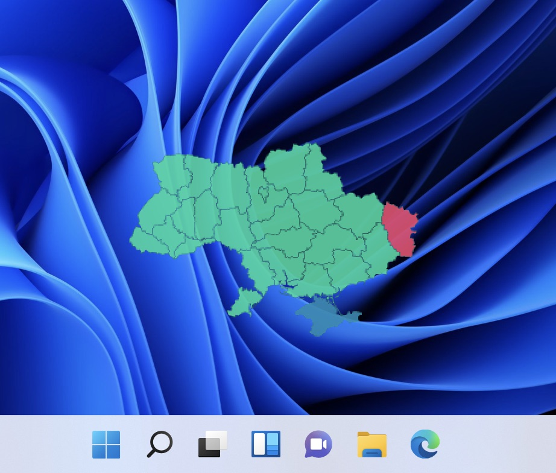

# Air Raid Widget for Windows

This widget shows the current status of air raid sirens in Ukraine. The data is pulled every 20 seconds from https://sirens.in.ua/

#### Version of this widget for other platforms:
* [macOS](https://github.com/dr-mod/air-raid-widget-macos)
* [Linux](https://github.com/dr-mod/air-raid-widget-linux)
* [RaspberryPi](https://github.com/dr-mod/air-raid-monitor)

## Installation
The widget is built on the Rainmeter platform.
1. Download and install [Rainmeter](https://www.rainmeter.net/) a desktop customization tool.
2. Download the latest Air Raid Widget from the [release section](https://github.com/dr-mod/air-raid-widget-windows/releases) from the assets *.rmskin 
3. If you have Rainmeter installed you could import the widget from its menu or simply by double-clicking on the widget file.

